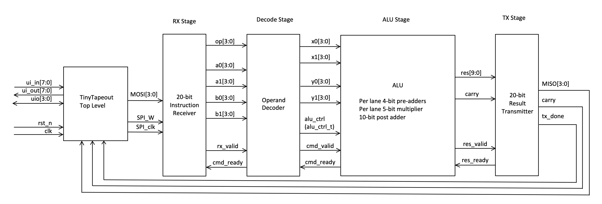

<!---

This file is used to generate your project datasheet. Please fill in the information below and delete any unused
sections.

You can also include images in this folder and reference them in the markdown. Each image must be less than
512 kb in size, and the combined size of all images must be less than 1 MB.
-->



## How it works

This 1x1 tile contains a math-accelerator unit (MAU) built around a 4-bit ALU pipeline.  
A host device communicates with the MAU over a simple SPI-style interface using the TinyTapeout pins.

Each operation is encoded as a 20-bit “instruction word”:

- 4 bits of opcode: which math operation to run (dot product, vector add/sub, sum of squares, distance², 2×2 determinant, scalar multiply, lerp, etc.)
- Four 4-bit operands: `a1`, `a2`, `b1`, `b2`

The host sends this instruction 4 bits at a time on `ui_in[3:0]` while toggling:

- `uio_in[0]` – SPI clock  
- `uio_in[1]` – write strobe (load data into the RX stage)

After 5 nibbles, the **RX stage** has a complete instruction and asserts a valid signal to the **decode stage**.  
The **decode stage**:

- Reads the opcode and selects which math operation to perform  
- Routes the four 4-bit operands into two internal “lanes” (X and Y)  
- Generates an `alu_ctrl_t` control signal package that is used to configure the ALU (pre-add, multiply mode, post-add/concat, add vs sub, etc.)
- Sends a valid command to the **ALU stage** when the ALU indicates it is ready

**alu_ctrl_t package**

| Field    | Width | Description                                                             |
|----------|-------|-------------------------------------------------------------------------|
| pre_x_en | 1     | X lane pre-adder enable (0:passthrough, 1:add/sub)                     |
| pre_x_sub| 1     | X lane pre-adder mode (0:add, 1:sub)                                   |
| mul_x_en | 1     | X lane mul enable (0:passthrough, 1:mul)                               |
| mul_x_sel| 3     | X lane mul input select (0:x0, 1:x1, 2:sqr 3:c 4:passthrough)          |
| pre_y_en | 1     | Same as X but for Y lane                                               |
| pre_y_sub| 1     | Same as X but for Y lane                                               |
| mul_y_en | 1     | Same as X but for Y lane                                               |
| mul_y_sel| 3     | Same as X but for Y lane                                               |
| post_en  | 1     | Post-adder en (0:concat, 1:add/sub)                                    |
| post_sub | 1     | Post-adder mode (0:add, 1:sub)                                         |
| post_sel | 1     | Post-adder input select (0:Y lane, 1:zero)                             |


The **ALU stage** is a single-cycle 4-bit core with:

- Per lane pre-adders (for adding or subtracting operand pairs)
- Per lane multiplier blocks that can multiply, square, or pass values through
- A combined post-stage that either concatenates the two lanes or adds/subtracts them

By enabling or bypassing these blocks, different opcodes implement functionality as outlined in the opcode table:

| Operation | OPCODE | Formula Index                                  | a0 | a1 | b0 | b1 | Notes                                                                                 |
|----------|--------|---------------------------------------------|----|----|----|----|---------------------------------------------------------------------------------------|
| NOOP     | 0x00   | 0. a<sub>0</sub>, a<sub>1</sub>, b<sub>0</sub>, b<sub>1</sub>                        | x<sub>0</sub> | x<sub>1</sub> | y<sub>0</sub> | y<sub>1</sub> | returns input                                                                         |
| DOT2     | 0x01   | 1. a<sub>0</sub>\*a<sub>1</sub> + b<sub>0</sub>\*b<sub>1</sub>                       | x<sub>0</sub> | y<sub>0</sub> | x<sub>1</sub> | y<sub>1</sub> |                                                                                       |
| WSUM     | 0x02   | 1.                                                                                   | x  | a  | y  | b  |                                                                                       |
| PROJ     | 0x03   | 1.                                                                                   | x  | u<sub>x</sub> | x  | u<sub>y</sub> |                                                                                       |
| SUMSQ    | 0x04   | 1.                                                                                   | x  | x  | y  | y  |                                                                                       |
| SCSUM    | 0x05   | 1.                                                                                   | x  | c  | y  | c  |                                                                                       |
| VADD2    | 0x06   | 2. (a<sub>0</sub> + a<sub>1</sub>), (b<sub>0</sub> + b<sub>1</sub>)                 | x0 | y0 | x1 | y1 |                                                                                       |
| VSUB2    | 0x07   | 3. (a<sub>0</sub> - a<sub>1</sub>), (b<sub>0</sub> - b<sub>1</sub>)                 | x0 | y0 | x1 | y1 | order into each lane matters                                                          |
| DIFF2    | 0x08   | 4. (a<sub>0</sub>\*a<sub>1</sub>) - (b<sub>0</sub>\*b<sub>1</sub>)                  | x0 | x1 | y0 | x1 | order of lanes matter                                                                 |
| DET2     | 0x09   | 4.                                                                                   | x<sub>0</sub> | y<sub>1</sub> | y<sub>0</sub> | x<sub>1</sub> | order of lanes matter                                                                 |
| DIFFSQ   | 0x0A   | 4.                                                                                   | x  | x  | y  | y  | order of lanes matter                                                                 |
| DIST2    | 0x0B   | 5. (a<sub>0</sub> - a<sub>1</sub>)² - (b<sub>0</sub> - b<sub>1</sub>)²              | x<sub>0</sub> | x<sub>1</sub> | y<sub>0</sub> | y<sub>1</sub> | order into and of each lane matters                                                   |
| POLY     | 0x0C   | 6. (a<sub>0</sub>\*a<sub>1</sub>) + (b<sub>0</sub>)                                 | a  | x  | b  | -  |                                                                                       |
| SCMUL    | 0x0D   | 7. (a<sub>0</sub>\*a<sub>1</sub>), (b<sub>0</sub>\*b<sub>1</sub>)                    | a  | b  | x  | y  | output concats to lower 9 bits for each lane                                          |
| LERPX    | 0x0E   | 8. (a<sub>0</sub>) + (a<sub>1</sub>\*(b<sub>1</sub> - b<sub>0</sub>))                  | x<sub>1</sub> | c  | y<sub>0</sub> | y<sub>1</sub> | order into and of each lane matters, c = (y2-y1)/(x2-x1)                             |
| LERPY    | 0x0F   | 9. (b<sub>0</sub>) + (b<sub>1</sub>\*(a<sub>1</sub> - a<sub>0</sub>))                 | x<sub>0</sub> | x<sub>1</sub> | y<sub>1</sub> | c  | order into and of each lane matters, c = (y2-y1)/(x2-x1)                             |

- `DOT2` – 2D dot product  
- `VADD2` / `VSUB2` – vector add/sub  
- `SUMSQ`, `DIST2`, `DIFFSQ` – sum of squares / distance² / squared difference  
- `DET2` – 2×2 determinant  
- `SCMUL`, `WSUM`, `PROJU`, `LERPX`, `LERPY` – scalar multiply, weighted sums, projection, and simple linear interpolation

The ALU produces a 10-bit result plus a carry flag, which are stored in a small output register.  

The **TX stage** then serializes this result back to the host:

- Result bits are packed into 4-bit chunks and driven on `uo_out[3:0]`
- The carry flag is exposed on `uio_out[3]`
- The host clocks the data out using `uio_in[0]` (SPI clock) and `uio_in[2]` (read enable)

All stages use valid/ready handshakes, so if the host stops reading results, backpressure propagates and the ALU will stop accepting new commands without losing any results.

## How to test

Below is a basic example of how to interact with the MAU hardware on a fabricated TinyTapeout chip. This code snippet demonstrates loading a 40 bit instruction and reading the result through the psuedo SPI interface.

```python
def send_instruction(tt, opcode, operands):
    #Load a 40 bit instruction into the MAU over 5 SPI clock cycles.
    #Args:
    #    tt: TinyTapeout interface object
    #    opcode: 8 bit operation code (e.g., 0x01 for DOT2)
    #    operands: List of four 8-bit operands [x0, x1, y0, y1]
    
    #Pack instruction into 5 bytes: [opcode, x0, x1, y0, y1]
    instruction_bytes = [opcode] + operands
    
    #Send each byte sequentially over the 8-bit input bus
    for byte in instruction_bytes:
        tt.input_byte = byte           #Place byte on ui_in[7:0]
        tt.uio.SPI_W = 1               #Assert write enable signal
        tt.clock_tick()                #Rising edge of SPI_clk to latch data
        tt.uio.SPI_W = 0               #Deassert write enable
    
def read_result(tt, num_bytes=3):
    #Read the result from the MAU over multiple SPI clock cycles.
    #Args:
    #    tt: TinyTapeout interface object
    #    num_bytes: Number of 8 bit chunks to read (3-5 depending on result size)
    #Returns:
    #    List of bytes representing the result (LSB first)

    result_bytes = []
    
    #Read each byte of the result sequentially
    for _ in range(num_bytes):
        tt.uio.SPI_R = 1                     #Assert read enable signal
        tt.clock_tick()                      #Rising edge of SPI_clk to output next byte
        result_bytes.append(tt.output_byte)  #Capture byte from ui_out[7:0]
        tt.uio.SPI_R = 0                     #Deassert read enable
    
    return result_bytes

#Example usage: Compute 2x1 vector dot product (DOT2)
#Operation: x0*x1 + y0*y1 = 2*3 + 4*5 = 6 + 20 = 26
send_instruction(tt, opcode=0x01, operands=[2, 3, 4, 5])

#Read 3 bytes of result (18-bit result + carry spans 3 bytes)
result = read_result(tt, num_bytes=3)

#Reconstruct the full result from received bytes
final_result = result[0] | (result[1] << 8) | (result[2] << 16)
print(f"DOT2 result: {final_result}")  # Expected: 26
```

The MAU processes instructions through its custom SPI interface, reading operands in sequence and returning results across multiple clock cycles to accommodate the 18-bit output width on an 8-bit bus.

## External hardware

List external hardware used in your project (e.g. PMOD, LED display, etc), if any
