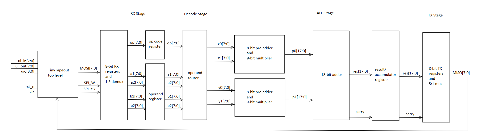

<!---

This file is used to generate your project datasheet. Please fill in the information below and delete any unused
sections.

You can also include images in this folder and reference them in the markdown. Each image must be less than
512 kb in size, and the combined size of all images must be less than 1 MB.
-->

## Project Description

This project implements a Math Accelerator Unit (MAU) in SystemVerilog, designed for integration on a TinyTapeout chip. The MAU is a specialized hardware block that performs selected mathematical operations faster and more efficiently than a general purpose CPU. In a typical system, the CPU can offload arithmetic heavy tasks to the MAU, improving overall performance while freeing CPU resources for other operations.

To implement some speedup to differentiate the MAU from a typical CPU, our design has parallel adders and multipliers to enable 2 lane Single Instruction/Multiple Data (SIMD2). This will be the main source of the speedup observed in the MAU, compared to the single ALU datapath of a traditional CPU.

The MAU supports vector, matrix, polynomial, and scalar arithmetic operations. By integrating these capabilities into a dedicated hardware datapath, the design demonstrates how specialized accelerators can improve throughput for math intensive workloads while remaining resource efficient in a constrained silicon environment.

## TT I/O Assignments

| Signal       | Description                       |
|--------------|-----------------------------------|
| `ui_in[7:0]` | Instruction / Operand input       |
| `ui_out[7:0]`| Result output                     |
| `uio[3:0]`   | SPI_clk, SPI_W, SPI_R, RES_CARRY  |
| `rst_n`      | Global TT reset                   |
| `clk`        | TT clock                          |

## Math Operations

|      Formula          | Operation | Description                                                      |
|-----------------------|-----------|------------------------------------------------------------------|
|      x0x1 + y0y1      | `DOT2`    | 2x1 vector dot product                                           |
|       x0a + y0b       | `WSUM`    | Weighted sum                                                     |
|      x0$\hat{u}$x + y0$\hat{u}$y      | `PROJU`   | Projection onto unit vector                                      |
|      x0x1 - y0y1      | `DIFF2`   | Difference of products                                           |
|      x0x1 + y0y1      | `SQM`     | Squared magnitude                                                |
|      x0y1 - y0x1      | `DET2`    | 2x2 matrix determinant                                           |
| (x0-x1)^2 - (y0-y1)^2 | `DIST2`   | Squared distance                                                 |
|       ax + b       | `POLY`    | First degree polynomial                                          |
|     x0+y0 , x1+y1     | `VADD2`   | Adds two 2x1 vectors                                             |
|     x0-y0 , x1-y1     | `VSUB2`   | Subtracts two 2x1 vectors                                        |
|      x0x1 , y0y1      | `SCMUL`   | Scalar multiplication (in pairs)                                 |
|       x0c , x1c       | `SCALE2`  | Scale a 2x1 vector by a scalar                                   |
|       x0c + x1c       | `SCSUM`   | Scaled sum                                                       |
|      x0 + c(y1-y0)    | `LERPX`   | Linear interpolation in lane X                                   |
|      y0 + c(x1-y0)    | `LERPY`   | Linear interpolation in lane Y                                   |

## System Architecture

Instructions consist of 40-bits - 8-bits for the opcode/flags and 8-bits for each of the four operands.

Due to the pin limitations of TinyTapeout, the input bus ui_in[7:0] is 8-bits wide and reading in the 40-bit instruction from the SPI's MOSI lanes is done in byte increments across 5 SPI clock cycles. The output bus ui_out[7:0] operates in a similar fashion by sending out 8-bits of the result at a time back through the SPI's MISO lanes. The uio[3:0] bidirectional pins carry the SPI control and data signals.

A custom 20 pin "parallel" SPI interface will be used to accomodate the 8 lane MOSI, 8 lane MISO, and single lane SPI_clk, SPI_W, SPI_R, RES_CARRY. Both write and read signals will be used to enable a true idle state.

As not all 8-bits of the opcode are required, 4 or so bits will be reserved for flags that can be used for control signals (such as accumulate_en, QNotation_en, X_en, Y_en).

RX Stage:

Implemented using an 8-bit RX register and 1:5 demux, the RX register samples MOSI[7:0] on SPI_CLK when SPI_W is active and a MOD-5 counter controls the demux output. The demux will then direct data to the correct lane registers where they are held until all operands have been saved. 

Decode Stage:

The lane registers holding the operands will then be fed into the correct ALU inputs with pathing determined by a FSM or LUT, activating control signals based on the opcode. Any flags provided in the opcode will also be directed here to the corresponding hardware it enables/disables.

ALU Stage:

The two lanes, denoted X and Y, will both consist of an 8-bit pre-add/sub followed by a 9x9-bit multiplier. Control signals will control data forwarding paths that enable different inputs into the adder/multiplier depending on the operation being performed. This unlocks operations that fixed data paths wouldn't be able to perform (such as squaring sums/differences).

After the multiplier, the two lanes converge into an 18-bit adder to calculate the final result. Once again, data forwarding paths can be used to bypass the reducer and output a 2-element vector output. The value is then stored into a result register that doubles as an accumulator register for consecutive 18-bit adds.

TX Stage:

Similar to the RX stage, the TX stage is implemented using 3-5 (depending on output clock cycle count) 8-bit TX registers and a 5:1 mux. The 5:1 mux outputs to MISO[7:0] on SPI_CLK when SPI_R is active, sending the final result across multiple 8-bit chunks. The maximum output size, given four 8-bit inputs going through an add -> multiply -> add, is 18 bits with a carry. Since only 8 bits are available on the output bus, results are serialized in the same wave-based manner. Encoding for the result will be fixed and will require sending 8-bits across another 3-5 SPI clock cycles to return the full result. (Requirement of symmetric RX/TX cycles to be determined)

## Project Work Schedule

Verilog coding and timing verification using CocoTB - Now until Oct 29 (4 weeks time)
 - Finalize block diagram with control signals (1 week)
 - Split up work (RX/TX stages should be similar, M/A stage logic should be standardized, Decode stage might be more difficult depending on finalized ctrl signals)
 - Code in verilog individual components (1 week)
 - Verify timing using CocoTB (1 week? using github actions?)

Task 2: Sub-block (verilog) evaluation - Oct 29  

Synthesis and verification with OpenLane and CocoTB - Oct 29 until Nov 19 (3 weeks time)
 - Update test.py?
 - Unsure about this workflow, will know more as project progresses
 - Work needs to be done to turn verilog modules into the standard cell designs provided by TT? and deciding placement within the tile, and then verification?
 - 1 week synthesis, 2 weeks verification/fixing?

Task 3: System integration - Nov 19
 - Clean up any loose ends

Final verification, completed documentation and github - Nov 26
 - Wrap up documentation and submission

Evaluation of final submissions and docs - Dec 3
 - Submit for tapeout
