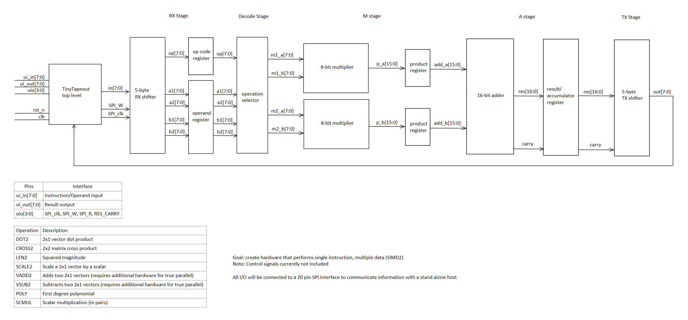

<!---

This file is used to generate your project datasheet. Please fill in the information below and delete any unused
sections.

You can also include images in this folder and reference them in the markdown. Each image must be less than
512 kb in size, and the combined size of all images must be less than 1 MB.
-->

## Project Description

This project implements a Math Accelerator Unit (MAU) in SystemVerilog, designed for integration on a TinyTapeout chip. The MAU is a specialized hardware block that performs selected mathematical operations faster and more efficiently than a general purpose CPU. In a typical system, the CPU can offload arithmetic heavy tasks to the MAU, improving overall performance while freeing CPU resources for other operations.

The MAU supports vector, matrix, polynomial, and scalar arithmetic operations. By integrating these capabilities into a dedicated hardware datapath, the design demonstrates how specialized accelerators can improve throughput for math intensive workloads while remaining resource efficient in a constrained silicon environment.

## TT I/O Assignments

| Signal       | Description                       |
|--------------|-----------------------------------|
| `ui_in[7:0]` | Instruction / Operand input       |
| `ui_out[7:0]`| Result output                     |
| `uio[3:0]`   | SPI_clk, SPI_W, SPI_R, RES_CARRY  |

## Math Operations

| Operation | Description                                                      |
|-----------|------------------------------------------------------------------|
| `DOT2`    | 2x1 vector dot product                                           |
| `CROSS2`  | 2x2 matrix cross product                                         |
| `LEN2`    | Squared magnitude                                                |
| `SCALE2`  | Scale a 2x1 vector by a scalar                                   |
| `VADD2`   | Adds two 2x1 vectors (requires additional hardware for true parallelism) |
| `VSUB2`   | Subtracts two 2x1 vectors (requires additional hardware for true parallelism) |
| `POLY`    | First degree polynomial                                          |
| `SCMUL`   | Scalar multiplication (in pairs)                                 |

## System Architecture

The input bus ui_in[7:0] is 8 bits wide, inputting an 8 bit opcode and four 8 bit operands. The output bus ui_out[7:0] is fully allocated to result data.

Because TinyTapeout limits the number of available pins, the MAU adopts a wave-based I/O scheme using SPI. Inputs and outputs are serialized into multiple 8-bit transfers synchronized with the SPI clock. The uio[3:0] bidirectional pins carry the SPI control and data signals.

Each operand can be up to 8 bits wide. The opcode is transferred first as the first 8 bits in the first clock cycle and stored in a register. The remaining four 8 bit operands and transferred within the subsequent cycle, following the same flow.

**3 bits for opcode, maybe remaining 5 bits says how many operands there are going to be?**

The maximum output size, given four 8-bit inputs, is 17 bits. Since only 8 bits are available on the output bus, results are serialized in the same wave-based manner, requiring up to three 8-bit output cycles to transmit the full result.

To implement some speedup to differentiate the MAU from a typical CPU, our design has parallel multipliers to enable Single Instruction/Multiple Data (SIMD). This will be the main source of the speedup observed in the MAU, as a typical CPU has a single ALU datapath.

## Project Work Schedule

Verilog coding and timing verification using CocoTB - Now until Oct 22 (4 weeks time)
    - Finalize block diagram with control signals (1 week?)
    - Decide how to split up work (RX/TX stages should be similar, M/A stage logic should be standardized, Decode stage might be more difficult depending on finalized ctrl signals)
    - Code in verilog individual components (2 weeks?)
    - Verify timing using CocoTB (1 week? not sure if this can be done individually or needs to be all together)

Task 2: Sub-block (verilog) evaluation - Oct 22

Synthesis and verification with OpenLane and CocoTB - Oct 22 until Nov 12 (3 weeks time)
    - Unsure how this is done, will know more as project progresses
    - Guessing some work needs to be done to turn our verilog logic blocks into the standard cell designs provided by TT and deciding placement within the tile, and then verification
    - 1 week synthesis 2 weeks verification/fixing?

Task 3: System integration - Nov 12
    - Clean up any loose ends

Final verification - Nov 19
    - Just some documentation left

Completed documentation and github - Nov 26
    - Done by this point, project should be ready for tapeout

Evaluation of final submissions and docs - Dec 3
    - Submission for tapeout
